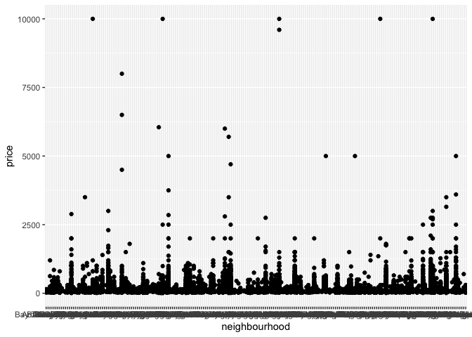

p8105\_class11
================
Tatini Mal-Sarkar
10/9/2018

``` r
library(p8105.datasets)
data(nyc_airbnb) 
nyc_airbnb %>% 
  group_by(neighbourhood) %>% 
  ggplot(aes(x = neighbourhood, y = price)) +
  geom_point()
```


